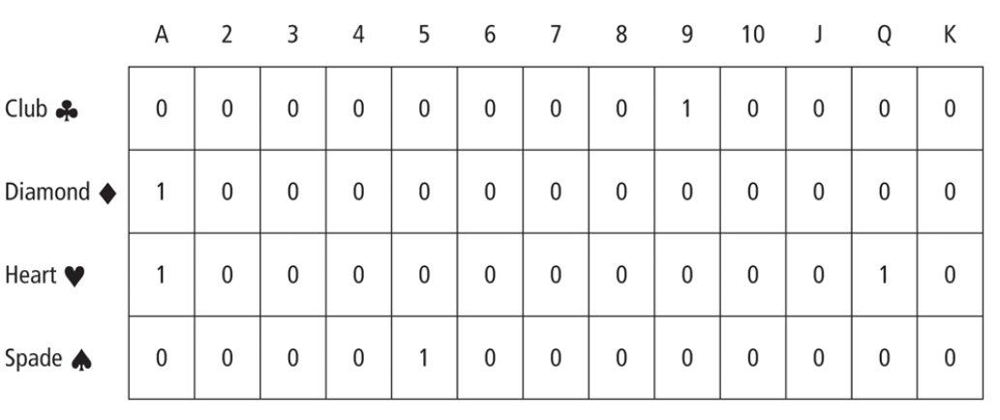

# Poker

A poker hand can be stored in a two-dimensional array. The statement

```
int hand[4][13];
```

declares an array with 52 elements, where the first subscript ranges over the four suits and the second subscript ranges over the thirteen ranks. A poker hand is specified by placing 1's in the elements corresponding to the cards in the hand. See Figure 1.

*Figure 1*


Write a program that requests the five cards as input from the user, creates the related array, and passes the array to procedures to determine the type of the hand: flush (all cards have the same suit), straight (cards have consecutive ranks—ace can come either before 2 or after King), straight flush, four-of-a-kind, full house (three cards of one rank , two cards of another rank), three-of-a-kind, two pairs, one pair, or none of the above.

```
Rank: Ace = 1, Jack = 11, Queen = 12, King = 13
SuitL Diamonds = D, Hearts = H, Clubs = C, Spades = S

Enter your card values:

Card #1: 5 D
Card #2: 5 H
Card #3: 5 C
Card #4: 12 S
Card #5: 12 D

The hand is a full house
```

## License
[License](LICENSE)